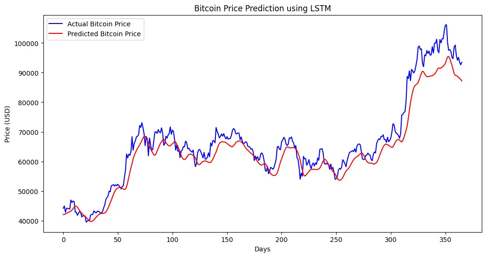

# Cryptocurrency Price Prediction using LSTM

This project was developed as part of the **Algonive Data Science Internship (Task 2)**.  
It focuses on predicting cryptocurrency prices — specifically **Bitcoin (BTC-USD)** — using a **Long Short-Term Memory (LSTM)** neural network for time-series forecasting.

---

## 📘 Project Overview

The main objective of this project is to forecast future cryptocurrency prices based on historical market data.  
LSTM, a deep learning model capable of learning long-term dependencies, is used to analyze Bitcoin price trends and generate predictions.

### 🔹 Key Features:
- **Data Collection:** Fetches real-time and historical Bitcoin data using Yahoo Finance API.  
- **Preprocessing:** Normalizes closing prices and creates 60-day time windows for model input.  
- **Model Building:** Builds a stacked LSTM network using TensorFlow/Keras.  
- **Evaluation:** Uses RMSE and MAE to evaluate prediction accuracy.  
- **Visualization:** Plots actual vs predicted Bitcoin prices for easy interpretation.

---

## ⚙️ How to Run the Project

### 1️⃣ Install Dependencies
Before running the project, install the required libraries by executing:
```bash
pip install -r requirements.txt
2️⃣ Run the Script

If you have saved the project as a Python file:

python crypto_lstm.py
If you’re using a Jupyter Notebook:

jupyter notebook
# then open and run the notebook file

📊 Results & Insights

The LSTM model predicts Bitcoin’s future closing prices based on past data.

Evaluation metrics such as RMSE (Root Mean Squared Error) and MAE (Mean Absolute Error) indicate the model’s accuracy.

A graph is generated comparing actual vs predicted prices, allowing clear visual assessment.

🧠 Key Learning Outcomes

Application of deep learning to financial time-series forecasting.

Understanding data preprocessing, normalization, and sequence creation for LSTM.

Implementation of a neural network using TensorFlow and Keras.

Performance evaluation using standard regression metrics.

🧰 Technologies Used

Programming Language: Python

Libraries:

NumPy

Pandas

Matplotlib

Scikit-learn

TensorFlow / Keras

yFinance (Yahoo Finance API)

## 📁 Folder Structure
Crypto_LSTM_Project/
│
├── crypto_lstm.ipynb    # Jupyter Notebook containing model code
├── app.py               # Streamlit web app
├── requirements.txt     # Python dependencies
├── README.md            # Project documentation
└── result.jpg           # Visualization of Actual vs Predicted Bitcoin Prices


👩‍💻 Author

Harshitha Mandala
📍 Data Science Intern – Algonive
📧 harshitha.mandala2@gmail.com


🏁 Conclusion

This project demonstrates how LSTM models can learn temporal relationships in financial datasets and predict cryptocurrency trends with reasonable accuracy.
It serves as a foundation for building more advanced forecasting, trading, and analytical systems in the future.

## 📊 Model Result Visualization

Below is the comparison between **Actual Bitcoin Prices** and **Predicted Prices** using the LSTM model:




